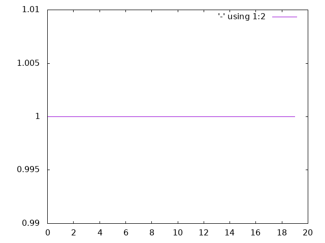
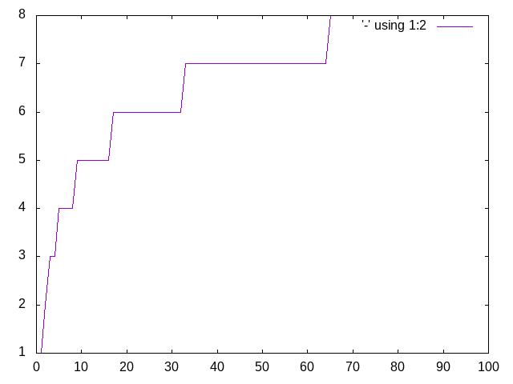
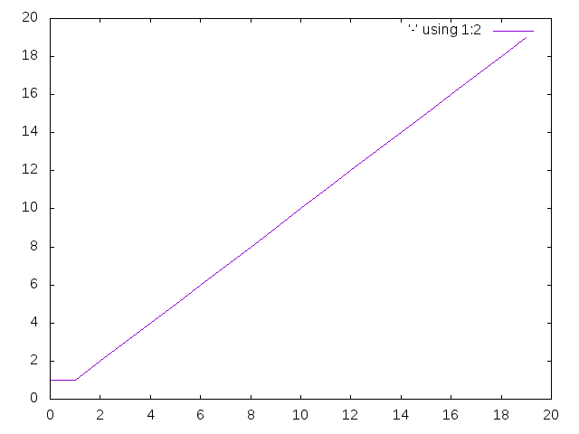
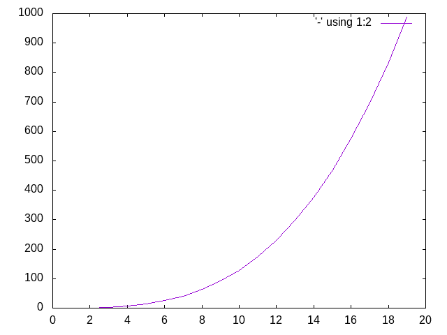

Not in active development. Outstanding issues marked as wontfix and closed.

----

## Big O Notation
See [how this documentation is generated](install.md).
### constant
O(1) - size of a vector

### logarithmic
O(log n) - binary search

### linear
O(n) - Factorial

### quadratic
O(n2) - insertion sort

### exponential
O(cn) where c > 1 - Fibonacci sequence

