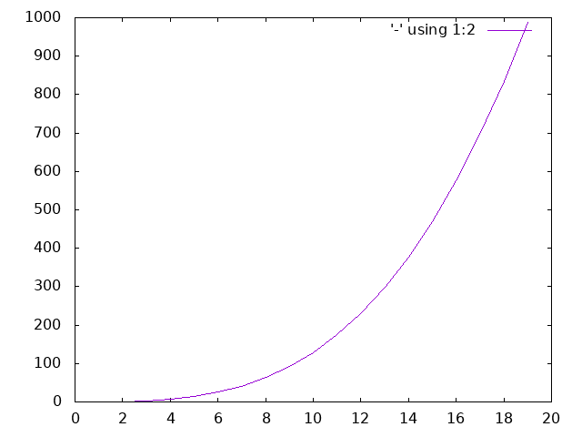

See [how this documentation is generated](install.md).
# constant
O(1) - size of a vector

# logarithmic
O(log n) - binary search

# linear
O(n) - Factorial

# quadratic
O(n2) - insertion sort

# exponential
O(cn) where c > 1 - Fibonacci sequence

