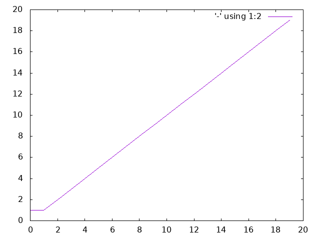
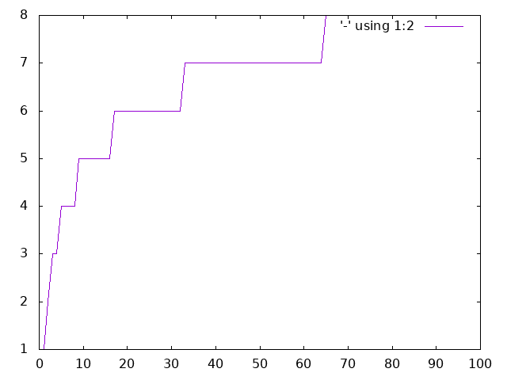

## Big O Notation
See [how this documentation is generated](install.md).
### exponential
O(c^n) where c>1 - Fibonacci sequence

### linear
O(n) - Factorial

### logarithmic
O(log n) - binary search

### quadratic
O(n^2) - insert sort

